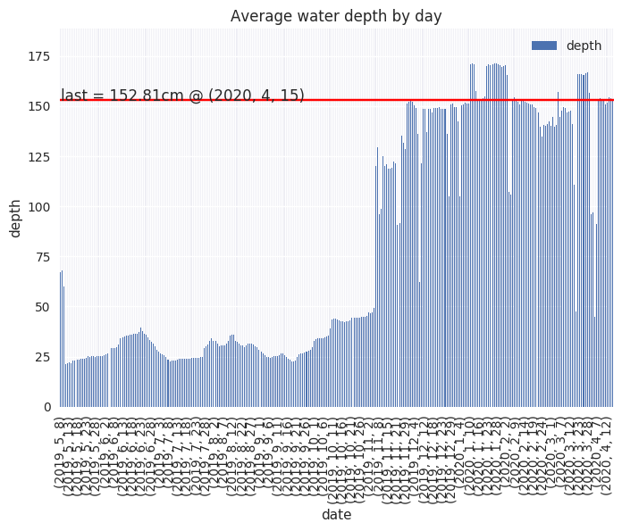
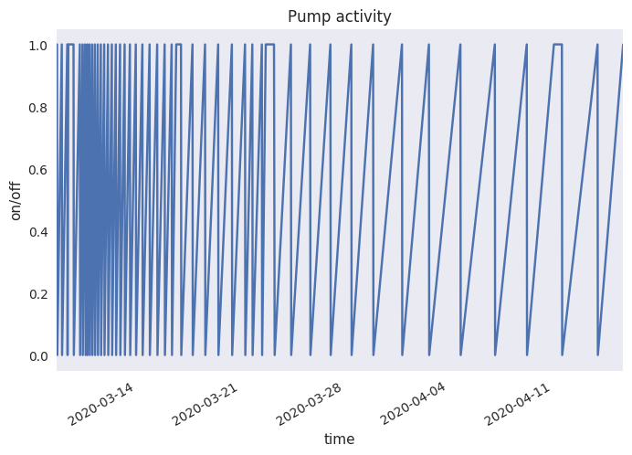
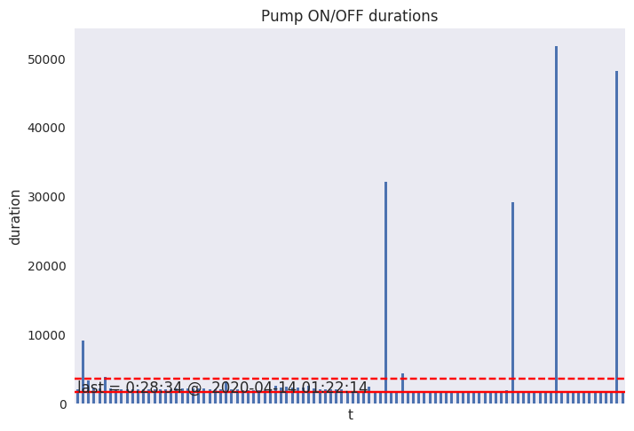
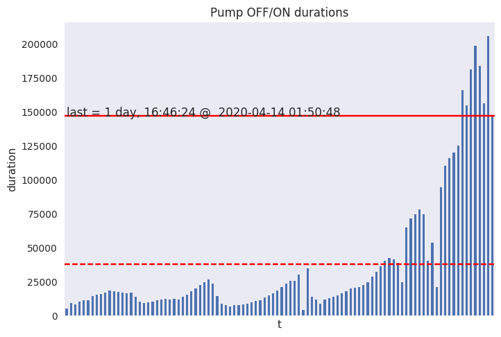

# Analysing data with Python

All of the sensor sampling and data upload is written in Python. But Python also has a very rich set of mathematical libraries and frameworks for analysing the data. The top-level README explains how to run the various programs for logging sensor data. This section describes how the graphs are generated in python (2 plot_data.py programs: 1 for the sensor plots, 1 for the weather data).

## What does it do?
There are 2 programs:
* [plot_waterdepth.py](plot_waterdepth.py) - generate graphs for the water level tank sensor
* [plot_weather.py](plot_weather.py) - generate graphs for the weather data
* [plot_pump.py](plot_pump.py) - generate graphs for the weather data

The programs take a CSV file containing data readings (download these from your ThingSpeak channel) then read the data into data structures (numpy arrays or pandas series/dataframes). The code then uses the various python libraries to calculate means, standard deviations and group the data in different ways to get some kind of insights. All of the data is then turned into some nice-looking graphs with MATPLOTLIB. They show how powerful the libraries are, and how you can quickly get some quite complex data calculations without too much effort.

Here are the graphs it produces. These are automatically refreshed on a regular basis and uploaded to github. So it is a kind of dashboard (not real-time, but at least every day):

---
## Sensor graphs
### Raw data with some basic mean/std deviation
This is the raw data, but complemented with some other basic lines:
* mean water level
* smooth water readings calculated using a rolling mean function
* standard deviation (+/- 1 std dev)


### Data cleaned by dropping readings > 1 std dev
This strips out data that exceeds 1 standard deviation from the mean (calculated with a rolling window). I was trying this as a way of cleaning up the data. The sensor is proving quite unreliable in the damp surroundings of a water tank.


### Average tank level per day
This graph averages the readings for a given day and plots this on a timeline, day-by-day for the entire data set. This shows how the water level fluctuates over the life-time of the project (up to the maximum 8000 data points allowed by ThingSpeak!)



---
## Sump Pump graphs
### Raw data
This is a plot of the raw sump data ON/OFF activity:


### Pump running durations
This is a plot of the individual durations when the pump is running:



...and this is a plot of the durations when the pump is off:




---
## Weather graphs
### Weather data correlations
This graph plots the different measurements (pressure, humidity, time, rainfall) against each other to determine any obvious correlations.
This is done in the weather/plot_data.py code by iterating over all the combinations and generating a grid of subplots. This is too large to display here, so view it [here](fig_weather.png).

### Humidity vs. Temperature
What do the graphs show (apart from the fact that weather patterns are complex and my analysis won't reveal very much)? Well, we can see that humidity and temperature seem inversely proportional - higher temperatures show lower humidity. Here is the specific graph:


## How does the code work?
I will write this up in more detail. In short:
* sensor data is read from a file via CSV reader; weather data is read from a file directly via numpy
* timezone handling is a bit of a pain
* vector handling and mathematical calculations (mean, standard deviation) are via numpy. Once you have numpy arrays, you can do a lot of data manipulation. And if you need to pass the data on to pandas, the numpy arrays play well with the other libraries.
* rolling mean calculations, 'group-by' operations and filtering of noisy data are via pandas (Series and Dataframes). This is great for functions that need to apply to a complete data set.
* graphs are generated using matplotlib (via pylot for non-pandas data, or the pandas API for more complex stuff). Matplotlib has endless possibilities for producing nice-looking graphs, so I've barely scratched the surface here.

## How do I run it?
First make sure the necessary python libraries are installed:
```
pip install numpy pandas matplotlib
```

Download the data files from your ThingSpeak.com channel (via their website). You could automate this if you like. Remember to choose the CSV format (we could have taken the JSON or XML formats, but CSV can be opened in Excel more easily).
Both progams run in the same way, providing the data file as a parameter:
```
python3 plot_waterdepth.py your_sensor_data.csv
python3 plot_weather.py your_weather_data.csv
python3 plot_pump.py your_pump_data.csv
```

The file formats from ThingSpeak are simple CSV files of the available data. The code assumes the data matches the channels that were setup in the main README. If the list of columns is different, you will need to change the code slightly. The program will read the data and output a bunch of graphs. These are saved as fig_XXX.png files in the working directory.
You can also get the program to display the graphs as they are calculated:

```
python3 plot_waterdepth.py --show your_data.csv
```
