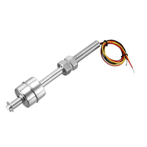
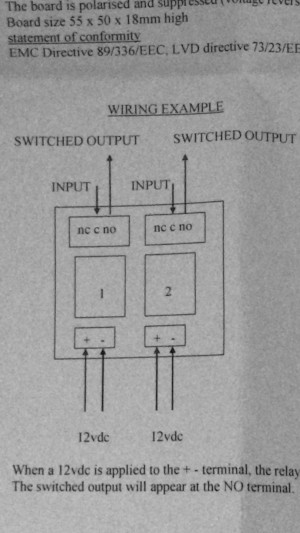
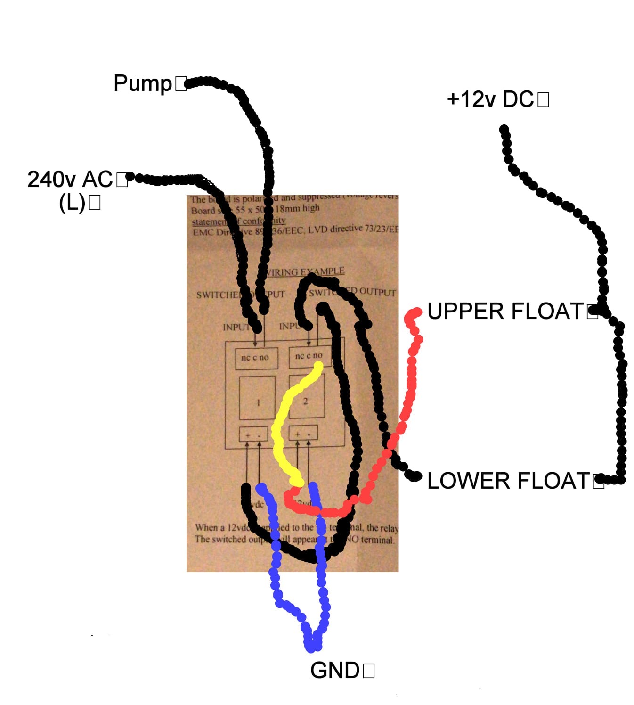
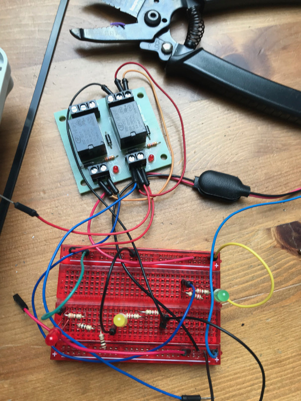
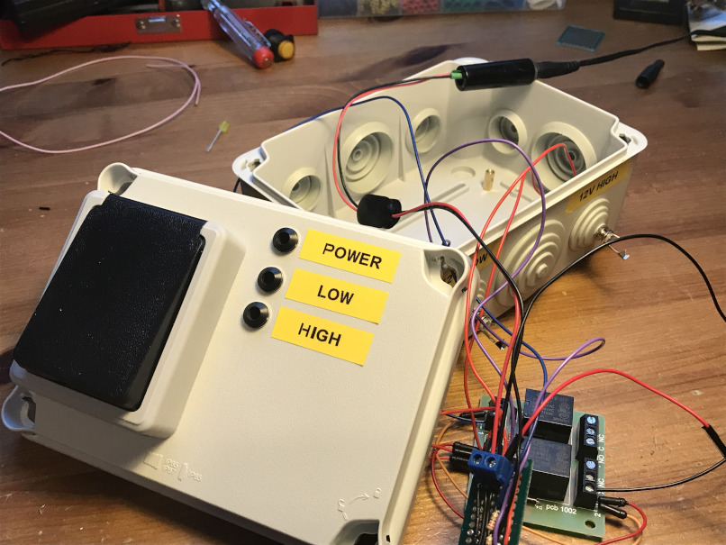

# A custom sump pump to monitor water levels

## The problem
Like many people, I have a sump pump running under my house that pumps out any excess water under the cellar. I started off with one of those general-purpose submersible pumps you find in any hardware store. You know, the ones with a bright-coloured float on a short cable:

This works just fine. Not too noisy. Pretty cheap. It can evacuate a lot of water when it needs to. But I was never really that happy with the solution.

First of all - the float activation. The pump works with an on/off float that gets pulled up as the water rises. When the water drops, the float returns back. Easy. But you don't get much control over when the pump actually switches on - it seems to vary quite a lot. Sometimes, the pump stays on all the time because the float got wedged against something. Not great!

And the other thing is the minimum water level. The float is attached to a short cable which you can lengthen/shorten to give some control over when the pump cuts out. But the minimum water depth is still too high for what I wanted - I want to pump out ALL of the excess water. Not really beause of concerns over flooding (the minimum water level is just fine), but I don’t like the idea of large quantities of water under my house. Maybe it is just me.

Basically, I was looking for something with a bit more precision over the water level trigger points. Something I can configure more easily. And who knows, maybe something I can hook up to some kind of monitoring.
After quite a few hours spent on the internet, a few false starts, and some guidance from my electrical-engineer brother, I came up with a solution. The rest of this page describes the final solution. I hope some of you find it useful. And notice how a simple idea gradually grows into something more and more complicated...!

## The pump controller logic (1st try – which doesn’t work!)
Let's start with an explanation of how the controller works.
The idea is to have a float switch that rises and falls with the water level. Not a clunky on/off float, but something with a bit more control like this:

As the water-level rises, the float engages. Use this to switch a relay that powers the pump, and the water is pumped away. As the water-level drops, the switch disengages and the pump cuts out. Each time it rains, the cycle begins again.

Sounds pretty simple...

## To switch or not to switch? (or how I learned what hysteresis is)
This is probably the most interesting part. In theory, the controller is just a switch that opens and closes the mains voltage supply as the float rises and falls. This is usually done via a relay. The main problem with sump pump controllers is how to avoid the problem of over-switching. The pump will kick-in once the water-level reaches a certain level, then start pumping out the water. As soon as the water starts to get pumped, the water-level drops and the pump immediately switches off again. This kind of on/off action is not healthy for pumps. Imagine that it is raining outside: the pump evacuates the water then immediately switches off, but the rain is filling the sump at the same time, so the water-level rises again, and the pump switches back on. And so the cycle repeats. Add in some water-surface ripples which can further disturb the water sensors and well, before long the pump starts to switch on and off endlessly which is the death knell for a pump. It will soon overheat and the pump lifetime will shrink enormously. Not to mention the incessant noise from the pump. End result: 1 dead pump.

So what is the solution?

My previous sump (with the bright-coloured float) uses a tethered float. This is slow to switch on the pump, but also slow to switch it off. This results in a gentle activation/de-activation cycle and avoids the rapid on/off cycle. So how to get something similar with my shiny new float?

Let's define 2 water-levels: an upper and lower - and get the pump to switch on/off based on these extreme values. As the water-level rises, wait until the water reaches the upper mark before starting. Then allow the pump to keep evacuating water until it reaches the lower mark. Once the pump switches off again, it waits until the water rises all the way to the upper level again before repeating the cycle. By separating the on/off triggers (upper/lower marks), we avoid the rapid switching that is causing so many problems.

The tricky part is the switching circuit. This is where hysterisis comes on. Hysterisis is the fancy name when the state of a system depends not only the current status (the water-level), but also what has happenned before. In other words, when switching the pump status, we look not only where the water level is, but also if the pump is currently on (if yes, then wait until we get to the lower-level; if not, then wait until we get to the upper level).

You will find quite a few different solutions on the internet. In fact, a surprising number of solutions! This is where my electrical-engineer brother came to the rescue.

## The circuit
I won't go into the pros and cons of all the solutions I found (or rather, the pros and cons that my brother explained to me!), but a few key principles helped shape the final circuit:

* Avoid electrodes - many solutions dip wires (or welding rods or any number of other variations) into the sump. These are positioned at the upper/lower positions. When the water rises, the water acts as a conductor and closes the circuit. The problem is that water will electrolyse the rods over time, causing a build-up. The conductivity will drop until it eventually doesn't work any more. Don’t do this. It is pretty easy to get stainless steel floats on-line. Either buy 2 floats (one for the upper-level, and one for the lower-level), or you can even buy a single piece with 2 integrated floats like this (this is the approach I went for):

* Keep it simple (mechanical not solid-state) – there are a lot of solutions based around solid-state circuits. These are often based around well-known chipsets used widely in electronics, so you can be pretty sure that these are tried and tested components. But the solution will have to work in some pretty unpleasant conditions (cold, maybe a bit damp). I wanted something simple that would keep running. And more to the point, when it stops running (as it inevitably will), I want to be able to work out why without messing around with semiconductors. I mean, it’s only a switch right, we are not building a computer!

*	Keep it safe – relays are used to separate low-voltage switching signals from high-voltage mains current. In theory, a single relay can do this job (low-voltage input, switching high-voltage output). But relays can fail and there is always a risk of voltages jumping across the gaps. No-one should be touching this circuit, but the last thing I want is to have high-voltage current running through my sump! In the solution below, I use 2 relays to keep the switching logic physically separate from the mains feed.

The final solution is known as a feedback circuit. This is very simple, but also quite clever.
First we take the double relays. The relay control signals are at the bottom, the switched outputs are at the top:

Now we annotate it with the wiring:

1. The lower-float acts as the state memory for the higher float. When the water reaches this lower-float, it primes the circuit. So far, nothing else happens: no pumping, no relay switching. But this step is key because it is what will ensure our pump stays on when it finally does get activated in Step 2. I extended the circuit to switch on a yellow LED at this point, but this is just window dressing .
1. The water keeps rising. Eventually, it reaches the level of the upper float. The upper float switch closes which activates the output of the right-hand side relay. Again, I extended the circuit here to light a green LED.
1. The signal of the right-hand relay is used to activate the left-hand side relay. I explained above why I preferred to have a 2nd relay to control the mains voltage and keep it separate from the low-voltage sensors. The relay switches over and enables the main current to flow. The pump jumps into life and starts pumping.
1. This is where it gets clever. A regular switch would keep pumping until the water drops below the upper level. But not this one. Even as the water-level drops and the upper float opens again, the pump keeps on running. Why? Because the feedback loop (shown in yellow in the schematic) from the lower-float ensures that the signal stays high. Even when the upper float opens again, the yellow wire keeps the relay switched open and the pump keeps running.
1. The pump continues to work and eventually the water-level drops below the lower-level. At this point, the lower-float switch opens and the feedback loop is broken. The right-hand relay closes. This cuts the signal to the left-hand relay, and the mains current stops. The pump switches off and we are back to the starting state.

All we have to do is wait until it rains again, and the entire cycle starts again.

I mocked up the circuit on a prototyping breadboard to check it was working.
A few additional LEDs show when the controller is plugged in (red) and when the lower- and upper-floats are activated (yellow/green). Remember to add in resistors to each LED circuit otherwise the 12V from the power supply will fry the LEDs. You need resistors around Ohms (LEDs typically expect around 12mA of current, so the resistance = 12v / 20mA = 600 Ohm.
Finally, I added an override switch to manually force the pump on (not shown).
The circuit looks a bit more complicated than the schema because I didn't have exactly the correct resistors, so had to chain a few together.

Once I was happy with everything, I transferred everything over to a prototype board and soldered it up.
Again, it looks a lot more complicated than it is because of all the resistors.

## The enclosure
Nearly there. We have a circuit, but I wanted it all packaged up into a box to protect it, and prevent anything coming near to the mains voltage. I bought a junction box so I could avoid too much drilling, and installed some 3.5mm jack sockets for the water-level sensors. The 12V transformer (used to power the relay and the sensors) was screwed to the junction box with some risers.
A mains socket was sliced apart and mounted on to the surface of the enclosure. This is the mains output that will be switched on/off by the water-level, and will power the sump pump.
A few labels on the outside, and we are good to go.

## Installing the floats
I wanted a way to install the floats in the sump, but also protect them from getting knocked around (I still wanted to keep my old sump pump as backup, but space gets a bit tight in there, and I was worried that my floats could get tangled up). I came up with a solution using a short piece of plastic drainpipe and a drainpipe bracket which I screwed to the side of the sump. The sensor was screwed into an end-pipe cover, and the pipe is adjusted to get the correct height:

IMG

## Buying a new pump
We have a pump controller and the water-level sensors. But back to the sump pump: my previous sump pump had an integrated pump and float. The solution I was coming up had a custom controller that separated out the pump-control logic - this meant buying a new standalone pump that could be switched on and off by switching the mains current. I went with this one - a pretty standard outdoor pond pump.

A few points that are important:
* The pump needs to be activated/de-activated only by opening and closing the current supply. No additional switches or manual button-presses needed.
* This pump is not submersible, but has a separate hose to suck the water. I didn't feel that strongly about an immersible vs. above-level pump. Some people say submersible pumps are quiter. But I wanted the option to use the pump in different settings (not just for a sump pump, but if I need to pump water from other places like water butts).
* The pump has a pressure sensor to detect when there is a blockage and cuts out the pump. This was purchased separately but just connects to the pump output. This is useful if you want to connect the pump to a hosepipe (when you close the hosepipe, the water pressure increases then eventually stops the pump), and I've used this a bit in other situations. But for this project, the pump just keeps running into the rainwater tank so I don't need the pressure control to cut the pump as the pressure builds up. However, what is really useful is that the pressure sensor will also prevent the pump from running dry. If ever the pump keeps running (maybe a failure in the controller circuit, or manually overriding the pump and forgetting to switch it off), it will be protected. The pressure sensor will detect the lack of water and cut out the pump (requiring a manual reset, but that is OK).

## Logging the sump activity via Raspberry Pi
Of course, all simple ideas soon grow into something more complicated. I wanted a way of monitoring the sump pump, particularly to get an idea how often it was switching on/off.

I decided to add an output signal to the controller which I could connect to a Raspberry Pi. The Raspberry Pi reads the signal via the GPIO, and logs the high/low (on/off) signals. The extension to the circuit is pretty simple. Just remember that the maximum input voltage to an Raspberry Pi is 3.3.V. My circuit was using a 12V supply, so I wired up a simple potential divider with 2 resistors to drop the signal to 3.3V.

The code monitors the GPIO PIN (via interrupts to avoid endlessly looping). Whenever there is a change of state, it logs the event to a ThingSpeak channel (I describe ThingSpeak in more detail in the other pi-tank-watcher pages, so I won’t repeat it here).

This is the pump activity I have been seeing:

If you measure only the periods when the pump is running (time from pump ON to pump OFF):

