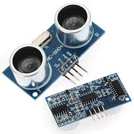
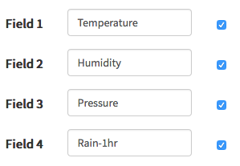
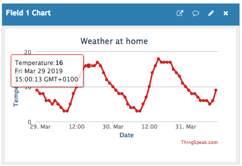
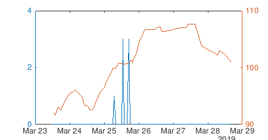
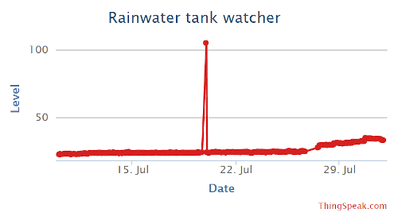
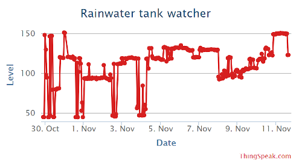

[](https://travis-ci.org/paulknewton/pi-tank-watcher)
[](https://codecov.io/gh/paulknewton/pi-tank-watcher)
[](https://pyup.io/account/repos/github/paulknewton/pi-tank-watcher)
[](https://pyup.io/account/repos/github/paulknewton/pi-tank-watcher)

[](https://deepsource.io/gh/paulknewton/pi-tank-watcher/?ref=repository-badge)

# pi-tank-watcher

Raspberry Pi project to monitor water depth in a rainwater tank using a HC-SR04 ultrasound sensor, and cross reference these to weather conditions. Logging and trend analysis via the ThingSpeak IoT platform and the python data libraries (pandas, numpy, matplotlib).

---
<!-- toc -->

  * [What is it?](#what-is-it)
  * [Raspberry Pi & the HCSR04 sensor](#raspberry-pi--the-hcsr04-sensor)
    + [Installing the sensor](#installing-the-sensor)
    + [The sensor code](#the-sensor-code)
    + [Setup ThingSpeak](#setup-thingspeak)
    + [Installing and running the code](#installing-and-running-the-code)
  * [The Raspberry Pi LCD](#the-raspberry-pi-lcd)
  * [Tracking the weather data](#tracking-the-weather-data)
    + [Setup ThingSpeak](#setup-thingspeak-1)
    + [Reading weather data from Accuweather](#reading-weather-data-from-accuweather)
    + [Logging the weather data](#logging-the-weather-data)
  * [Analysing the data](#analysing-the-data)
    + [ThingSpeak & MATLAB](#thingspeak--matlab)
    + [Python: Numpy, Pandas & Matplotlib](#python-numpy-pandas--matplotlib)
  * [Connecting an external sump pump](#connecting-an-external-sump-pump)
- [My experiences so far](#my-experiences-so-far)
- [The files](#the-files)

<!-- tocstop -->
---


## What is it?
Flushing toilets. Watering the grass. Cleaning the car.

You must have noticed how much water we all use, not to mention how expensive it is becoming. And all of that water we throw on the plants is drinking water. What a waste!

I installed one of those big underground rainwater tanks in my lawn. Water collects from the house roof into the tank, then is pumped out on demand to feed the toilets or outside garden taps.

I get a lot of rain where I live, so the tank was often pretty full. But the problem was...I would end up using even MORE water, because I knew it was free and there would be plenty more rain along soon. Sometimes I would even empty the tank without even realising: watering the lawn, pressure cleaning the terrace... Even worse, the system automatically switches over to the town water once the tank is empty. I could end up wasting more water than I would without the rainwater tank!

Many times I would be down on hands and knees to open the tank access cover, and peering down to seen if I still had water. There had a be a better way. Enter...Pi Tank Watcher.

This project measures the water depth on a regular basis using a Raspberry Pi and a cheap ultrasound sensor. It tidies up the readings to remove any noise, then uploads the values to the [ThingSpeak](https://thingspeak.com/) IoT platform. ThingSpeak is an interesting platform from the makers of MATLAB (the mathematical computation framework). You can log data using a simple REST API, then use the data via the ThingSpeak platform to display and analyse further. This can be as simple as displaying a graph, or using this to cross-reference against weather data. The only limitation is your imagination. You can even view the data on your phone.

I then use the AccuWeather service to read weather data for the region where I live, to identify correlations and patterns. All of this is done using the MATLAB maths framework supported on ThingSpeak.

Now I always have the latest water readings on my phone so I can use the water more responsibly. In summer months I can see how the water levels drop, then adjust the water consumption appropriately. The next step is to see how the water levels correlate to changing weather conditions and see if I can identify any interesting patterns. I'll keep you posted!

The rest of this README explains how to setup the project:
* Raspberry Pi & the HCSR04 sensor - wiring the sensor  to the Pi and running the logging script to record samples. Includes uploading the sensor data to ThingSpeak
* The Raspberry Pi LCD - (not yet written) a sub-project to display key information and readings on an LCD connected to the Pi. You don't need this piece of course.
* Tracking the weather with Accuweather - reading weather data from Accuweather and using this to cross-reference with the water-level readings.
* Analysing the data - I include some examples using MATLAB to generate graphs directly from the ThingSpeak.com platform. I also show how to use python and many data libraries to perform some more complex analysis.
* Connecting an external sump pump - I have a custom sump pump controller which monitors the water level under by house, and pumps water from the ground - into the rainwater tank - when the level exceeds a certain level. Once the water is evacuated, the pump cuts out and waits again the water level to rise. I connected this pump the Raspberry Pi so I can log when the pump switches on/off (via ThingSpeak). 

## Raspberry Pi & the HCSR04 sensor
I have accumulated a lot of [Raspberry Pis](www.raspberrypi.org) over the years. Cheap and flexible computers that you can use for all kinds of automated tasks.

I decided to connect an ultrasound sensor to the raspberry pi GPIO port, and use this to measure the depth of the water in the tank. An echo wave is fired out to the water, reflects off the water surface and is collected by the sensor. With some simple maths and the speed of sound, you can calculate the depth of the water.

### Installing the sensor
There are a lot of tutorials on wiring up an ultrasound sensor (like [this one](https://www.modmypi.com/blog/hc-sr04-ultrasonic-range-sensor-on-the-raspberry-pi) or [this one](https://www.raspberrypi-spy.co.uk/2012/12/ultrasonic-distance-measurement-using-python-part-1/)). The HCSR04 sensor seems very common and only costs a few euros from ebay. It is simple to wire up - you just need a few resistors for a potential divider circuit.



I have quite a few pipes and cables dangling around the top of my rainwater tank, so I installed the sensor at the top of a plastic pipe, then stood the pipe vertically in the water. Apparently this helps reduce stray waves bouncing off the sides of the tank. This seems to work quite well, but it does increase the condensation levels on the sensor. It's up to you. The sensors are so cheap, you can afford to make a few mistakes.


### The sensor code
The basic script to trigger the sensor and take a measurement is taken pretty much from the tutorials above, or any of the other tutorials out there on the web. It triggers an echo signal then measures how long it has to wait for the signal to return. The wave speed is fixed, so you can work out the distance travelled. This is suprisingly reliable.

The code has configurable values for the GPIO pins being used. If you are following the tutorial above then the pin values are fine. Otherwise you may need to modify them.

I noticed that the readings did vary on occasion, so I extended the program to take multiple readings then calculate the arithmetic mean. The sensor can occasionally give a bad reading, so I added some code to remove outliers (anything greater than 1 standard deviation from the median is stripped out).

Once we have a reliable reading, we can calculate the height of the water based on the height of the sensor above the tank base. You will need to modify this value based on how high/low you install your sensor.

### Setup ThingSpeak
The point of this project is to record the water depth so I can easily view it, and so I can analyse how this changes based on weather conditions. This is where the ThingSpeak platform comes in.

The python code will log the water measurements to a ThingSpeak channel. You will need to register to the ThingSpeak platform then create your own channel. The channel needs a single field - "Level":


Each channel has a (private) API key used by the logging application to record data. You will need to add this API into the python code.

Each time the progrm runs, it records the water level on the channel. You can then view this online (via the ThingSpeak web pages). There is also a simple app for iOS called [Thingview](https://itunes.apple.com/uy/app/thingview/id1284878579). This allows you to access the basic ThingSpeak graphs from your phone (it does not allow you to view any fancy MATLAB visualisations that you may have defined, but it is fine for monitoring the water levels).

### Installing and running the code
1. First install the Python libraries on the Pi:
    ```
    sudo apt-get update
    sudo apt-get install rpi.gpio
    ```
1. Enable the GPIO on the Pi
    ```
    sudo raspi-config
    ```
    and enable the I2VC and SPI settings from the menu. Restart the Pi.(TODO).
1. Install the other python libraries (if you are using a virtualenv, then drop the 'sudo'):
```
    cd pi-tank-watcher
    pip install -r requirements_dev.txt
    pip install -r requirements.txt
```
1. Modify the pin settings in pi_tank_watcher.py. These need to match the pins where you connected your sendor (default values may be OK: 23 for the trigger; 24 for the echo)
    ```
    hcsr04_sensor = Hcsr04Sensor(23, 24)
    ```  
1. Measure the height of your sensor above an empty tank. You will need this later when invoking the program.
1. Create your ThingSpeak channel and note down the write API key. Again, you will use this later.
1. Run the python code (with python 3) to take a measurement. Provide the API key and sensor height as parameters.
    ```
    python3 tank_watcher.py thing_speak_api sensor_height
    ```
    It will take many (20) samples - pausing in between each sample - and print out the various calculations it is performing. Check the values look correct. It will then try to log the average value to ThingSpeak. Log on to ThingSpeak and check the data point has been recorded.
    
    
    
1. Once you are sure it is working, schedule the program as a cron job (e.g. every hour). Note your path to a Python interpreter may be different.
    ```
    0 * * * * /usr/bin/python3 /home/pi/pi-tank-watcher/tank-watcher.py thing_speak_api sensor_height
    ```
1. (Optional) Install the Thinkview app on your phone so you always have access to the data, even on the go.

Once the program is up and running, you should get data points being logged to ThingSpeak.
The default ThingSpeak channel will give you a nice graph. [Here is mine](https://thingspeak.com/channels/694537/charts/1?bgcolor=%23ffffff&color=%23d62020&dynamic=true&results=60&type=line&update=15):


## The Raspberry Pi LCD
TODO
(This section will eventually describe how to add an Adafruit LCD to the Pi to display readings)

## Tracking the weather data
This section of the project is going to log weather data for our particular region. This will be recorded via a ThingSpeak channel so we can log the data and combine it with our water-level data from the sensor

### Setup ThingSpeak
Just like the sensor section above, we will setup a ThingSpeak channel to log our weather data. Go to ThingSpeak.com, logon on the site and create a new channel. This time the channel needs a few more values:



Your channel will be assigned an API key for writing data (click on the "API Keys" tab). You will need this later when configuring the logging tool.

### Reading weather data from Accuweather
TODO

### Logging the weather data
TODO


## Analysing the data
OK - we are nearly there. We have the water level logged by the Pi to the ThingSpeak platform. We have weather data logged to ThingSpeak.
Now let's try to put everything together - correlating water levels to weather (e.g. rainfall).

### ThingSpeak & MATLAB
As a first step, we are going to use the MATLAB functions provided by ThingSpeak. These offer a powerful analysis framework combined with graphing features. And it is all available for free on the ThingSpeak platform. We are going to use MATLAB to read water level and rainfall data then plot it together.

First, let's see what we are aiming for - a graph showing the 2 values. Here is a [link to the live graph](https://thingspeak.com/apps/plugins/273517), or a screenshot below:



How to achieve this? Create a new 'visualisation' (the term used by ThingSpeak to create custom code). Enter this code below (or download the [rainfall-vs-waterlevel.matlab](rainfall-vs-waterlevel.matlab) file:
```
weatherChannel = [PUT_YOUR_WEATHER_CHANNEL_HERE];
weatherAPIKey = 'PUT_YOUR_WEATHER_READ_API_KEY_HERE';
rainfallField = [4];

tankChannel = [PUT_YOUR_WATERLEVEL_CHANNEL_HERE];
tankAPIKey = 'PUT_YOUR_WATERLEVEL_READ_API_KEY_HERE';
tankLevelField = [1];


% Read rainfall
[rainfall, t1] = thingSpeakRead(weatherChannel, 'Fields', rainfallField, 'NumPoints', 8000, 'ReadKey', weatherAPIKey);

% Read tank water level
[waterLevel, t2] = thingSpeakRead(tankChannel, 'Fields', tankLevelField, 'NumPoints', 8000, 'ReadKey', tankAPIKey);

%% Visualize Data %%

% vectors must be the same length
n = min(numel(rainfall), numel(waterLevel))
t1 = t1(end-n+1:end)
rainfall = rainfall(end-n+1:end)
t2 = t2(end-n+1:end)
waterLevel = waterLevel(end-n+1:end)
waterLevel = movmean(waterLevel,40);

plotyy(t1, rainfall, t2, waterLevel)
```
The code is reasonably self explanatory. It reads the sensor and rainfall data from the 2 channels then truncates these to be the same size (because we will draw them on the same graph). Before plotting the values we 'smooth' the waterlevel sensor data. The sensor logging tool already tries to eliminate noise by stripping outliers (see above). However, we still occasionally get some strange values, so we further smooth the data using a moving mean function. (UPDATE: the 'strange' readings got so bad that the sensor is now at a point that it is unusable. See the 'lessons learned' section below).

You need to enter the channel IDs and API keys in the code before executing it (get these from the ThingSpeak pages). Click 'Save & Run' and it should create a new graph. If it fails, you will get some debugging output from the MATLAB interpreter. Once you are happy with the graph you can add it to a channel and make it public/private.

### Python: Numpy, Pandas & Matplotlib
MATLAB seems like a really powerful framework. My old PhD colleagues were all using it. But I like open-source tools, and I like tools that fit in with the skills I already have. Python has long been a favourite of scientists so I thought I would experiment with the various python libraries to see what I could come up with. You can do lots of stuff like this:


I was so impressed by the libraries in python than I wrote it up in a separate page [here](GRAPHS.md).

I put all of the main graphs into a single dashboard that you can view [here](https://paulknewton.github.io/pi-tank-watcher).

## Connecting an external sump pump
The Pi also monitors the sump pump under my house using a custom sump pump controller that I built. This switches a sump pump on and off based on the water-levels under my house, and uses this to fill the rainwater tank. This is described in detail [here](PUMP.md).


---
# My experiences so far
The sensor has been running for some time now (since Feb/March 2019), so I thought I would record a few experiences and lessons learned:

* *The Raspberry Pi is great* - I've been a big fan of this small computer for a long time. Both for the things you can achieve with it (like this) and the wider picture of how it is trying to engage kids with the wonders of technology. I've used Pis for plenty of different things but this is the first time I am hooking it up to a sensor. The world of IoT has unleashed tons of boards, interfaces and dongles. I know many people will say a simpler platform like the Arduino is better for this kind of basic project (lower power, more robust, cheaper). Many might even say a mechanical water-level float is sufficient. Maybe they are right. All I can say is that for projects like this that interact with the real-world (via GPIO) and do some kind of non-trivial processing (stripping outlier readings, uploading data via REST and even generating some analytics)...well, I find the Pi unbeatable. It uses the same tools and programming environment that you find on your desktop - you write once and run anywhere. Do not underestimate the importance of a homogeneous toolbox! And most of all, this has been great fun...

* ThingSpeak.com is great - I discovered this platform quite by accident, but I have been really happy with it so far. Data logging is as simple as a REST call. No complicated interfaces or libraries. No problems with availability. The standard graphs are great, and you have all the flexibility of MATLAB for producing your own custom graphs and transformations. I have only learned some MATLAB basics, so I can't comment more on this framework (although thousands of mathematicians and scientists can't be too wrong). For what I needed - and I imagine this would be more than enough for most projects - I think this is a great IoT platform. And of course, it is free which isn't too bad!

* *The HC-SR04 sensor is sometimes great, but sometimes not* - ultrasonic sensors don't come cheaper than this. These little sensors open up a world of possibilities for spatial detection with almost no cost. My first experiments with these were so positive - I couldn't believe the accuracy and the ease of use. But since wiring the sensor up and sticking it in a damp water tank, I've had some mixed results. At first - in the damp weeks of spring - the sensor started off well, but quickly started to become a bit erratic. Most of the readings were pretty good, but these would gradually degrade (at first a few rogue readings, but getting gradually worse until they were useless). I already changed the sensor once, which immediately returned the sensor readings to their former glory. But that didn't last long, and it wasn't long before the readings were degrading again. I added some noise reduction code to take multiple readings and drop any obviously rogue readings (> +/- 1 std dev). The graph generation code also strips out outliers based on a rolling standard deviation calculation. This helped quite a lot to give a smoother graph, but I couldn't help thinking this was a bit upside down (cleaning readings that are obviously bad). However, things changed again as we entered the extreme hot summer months. The readings improved endlessly. Not a single rogue reading in sight, and seemingly near-perfect accuracy. I assume this is coming from the damp and generally unpleasant conditions of living in a water tank for weeks on end. And sure enough, as we enter the winter season the readings have degraded to the point of being unusable. Compare the 2 graphs below:


*Summer Readings:*
Near perfect...



*Winter Readings:*
Unusable...



---
# The files
* README.md	- this file!
* requirements.txt - python installation dependencies
* .travis.yml - config for Travis-CI.org continuous integration site
* img folder - misc files used in this README and the other Markdown pages on this site
* lcd folder - files for displaying info on the Pi LCD screen
    * create-msg.sh	- UNUSED. Script to generate a message for display on the Pi LCD screen.
    * display-tank-msg.py - UNUSED. Python script to show a message on the Pi LCD screen. Planned for the future for showing the water level on the Pi LCD.
    * lcd_off.py - UNUSED. Script to switch off the Pi LCD screen. Not used yet.
    * sample-lcd-msg.txt - UNUSED. A sample message to show on the LCD screen. Used during testing.
* files for logging water-level data from the sensor
    * tank_watcher.py - the main program you need. This takes water measurements via the sensor and logs these to ThingSpeak.
    * test_tank_watcher.py - PyTest unit tests for the sensor logging
    * rainwater-vs-waterfall.matlab - ThingSpeak code to plot water level sensor data against rainfall
    * thing_speak.py - wrapper class to log data to an (arbitrary) ThingSpeak channel
* some generated graphs
    * GRAPHS.md
    * plot_waterdepth.py - plot graphs of the water level
    * graphs/fig_avg_daily.png
    * graphs/fig_avg_hourly.png
    * graphs/fig_clean_sensor.png
    * graphs/fig_sensor.png
    * plot_weather.py - plot graphs of the weather
    * graphs/fig_weather.png
* files for the sump pump monitor
    * pump_watcher.py - record pump on/off and log these to ThingSpeak
    * test_pump.py - PyTest unit tests for the pump monitor
* files for accuweather
    * log_accuweather.py - record weather values and log these to ThingSpeak.
    * sample-accuweather.json - A dummy sample of JSON weather data. Used to test the weather logging process.
    * join_sensor_weather.py - unused
