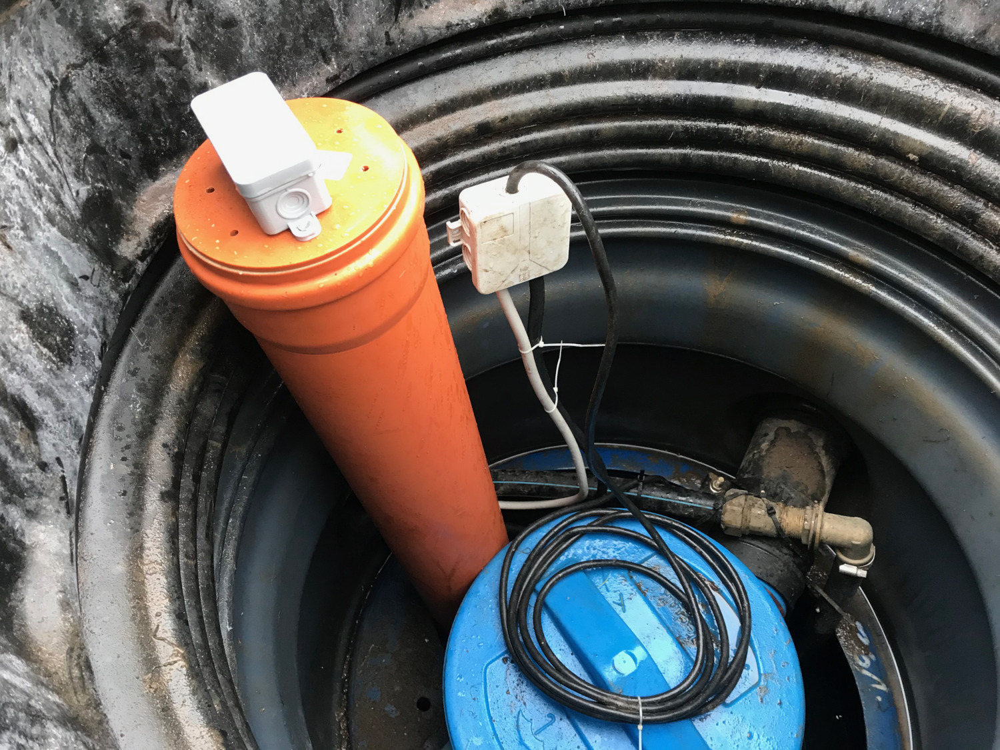
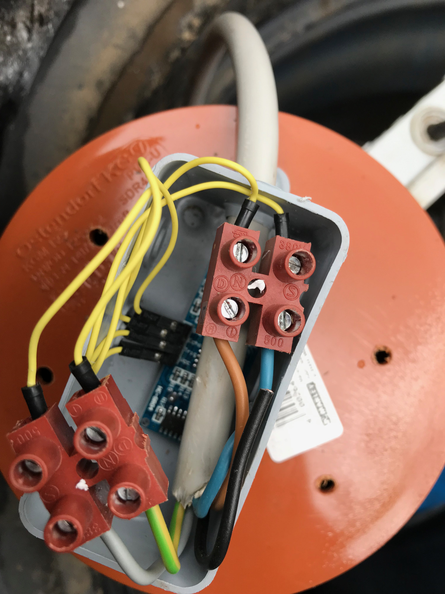
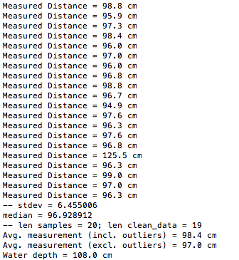
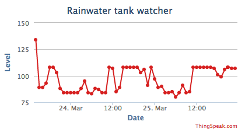

# pi-tank-watcher

Raspberry Pi project to monitor water depth in a rainwater tank using a HC-SR04 ultrasound sensor, and cross reference these to weather conditions.

## What is it?
Flushing toilets. Watering the grass. Cleaning the car.

You must have noticed how much water we all use, not to mention how expensive it is becoming. And all of that water we throw on the plants is drinking water. What a waste!

I installed one of those big underground rainwater tanks in my lawn. Water collects from the house roof into the tank, then is pumped out on demand to feed the toilets or outside garden taps.

I get a lot of rain where I live, so the tank was often pretty full. But the problem was...I would end up using even MORE water, because I knew it was free and there would be plenty more rain along soon. Sometimes I would even empty the tank without even realising: watering the lawn, pressure cleaning the terrace... Even worse, the system automatically switches over to the town water once the tank is empty. I could end up wasting more water than I would without the rainwater tank!

Many times I would be down on hands and knees to open the tank access cover, and peering down to see if I still had water. There had a be a better way. Enter...Pi Tank Watcher.

This project measures the water depth on a regular basis using a Raspberry Pi and a cheap ultrasound sensor. It tidies up the readings to remove any noise, then uploads the values to the [ThingSpeak](https://thingspeak.com/) IoT platform. ThingSpeak is an interesting platform from the makers of MATLAB (the mathematical computation framework). You can log data using a simple REST API, then use the data via the ThingSpeak platform to display and analyse further. This can be as simple as displaying a graph, or using this to cross-reference against weather data. The only limitation is your imagination. You can even view the data on your phone.

Now I always have the latest water readings at hand so I can use the water more responsibly. In summer months I can see how the water levels drop, then adjust the water consumption appropriately. The next step is to see how the water levels correlate to changing weather conditions and see if I can identify any interesting patterns. I'll keep you posted!

## Raspberry Pi & the HCSR04 sensor
I have accumulated a lot of [Raspberry Pis](www.raspberrypi.org) over the years. Cheap and flexible computers that you can use for all kinds of automated tasks.

I decided to connect an ultrasound sensor to the raspberry pi GPIO port, and use this to measure the depth of the water in the tank. An echo wave is fired out to the water, reflects off the water surface and is collected by the sensor. With some simple maths and the speed of sound, you can calculate the depth of the water.

## Installing the sensor
There are a lot of tutorials on wiring up an ultrasound sensor (like [this one](https://www.modmypi.com/blog/hc-sr04-ultrasonic-range-sensor-on-the-raspberry-pi) or [this one](https://www.raspberrypi-spy.co.uk/2012/12/ultrasonic-distance-measurement-using-python-part-1/)). The HCSR04 sensor seems very common and only costs a few euros from ebay. It is simple to wire up - you just need a few resistors for a potential divider circuit.

I have quite a few pipes and cables dangling around the top of my rainwater tank, so I installed the sensor at the top of a plastic pipe, then stood the pipe vertically in the water. Apparently this helps reduce stray waves from bouincing off the sides of the tank. This seems to work quite well, but it does increase the condensation levels on the sensor. It's up to you. The sensors are so cheap, you can afford to make a few mistakes.





## The sensor code
The basic script to trigger the sensor and take a measurement is taken pretty much from the tutorials above, or any of the other tutorials out there on the web. It triggers an echo signal then measures how long it has to wait for the signal to return. The wave speed is fixed, so you can work out the distance travelled. This is suprisingly reliable.

The code has configurable values for the GPIO pins being used. If you are following the tutorial above then the pin values are fine. Otherwise you may need to modify them.

I noticed that the readings did vary on occasion, so I extended the program to take multiple readings then calculate the arithmetic mean. The sensor can occasionally give a bad reading, so I added some code to remove outliers (anything greater than 1 standard deviation from the median is stripped out).

Once we have a reliable reading, we can calculate the height of the water based on the height of the sensor above the tank base. You will need to modify this value based on how high/low you install your sensor.

## Setup ThingSpeak
The point of this project is to record the water depth so I can easily view it, and so I can analyse how this changes based on weather conditions. This is where the ThingSpeak platform comes in.

The python code will log the water measurements to a ThingSpeak channel. You will need to register to the ThingSpeak platform then create your own channel. The channel needs a single field - "Level". Each channel has a (private) API key used by the logging application to record data. You will need to add this API into the python code.

Each time the progrm runs, it records the water level on the channel. You can then view this online (via the ThingSpeak web pages). There is also a simple app for iOS called [Thingview](https://itunes.apple.com/uy/app/thingview/id1284878579). This allows you to access the basic ThingSpeak graphs from your phone (it does not allow you to view any fancy MATLAB visualisations that you may have defined, but it is fine for monitoring the water levels).

## Installing and running the code
1. First install the Python libraries on the Pi:
    ```
    sudo apt-get update
    sudo apt-get install rpi.gpio
    ```
1. Enable the GPIO on the Pi
    ```
    sudo raspi-config
    ```
    and enable the I2VC and SPI settings from the menu. Restart the Pi.(TODO).
1. Modify the settings in hcsr04_sensor.py to match your GPIO pins (default values may be OK)
    ```
    # GPIO Pins connected to sensor
    GPIO_TRIGGER = 23
    GPIO_ECHO = 24
    ```  
1. Measure the height of your sensor above an empty tank. Insert this value into the code.
    ```
    # sensor dimensions (to convert reading to water depth)
    SENSOR_HEIGHT = 205
    ```
1. Create your ThingSpeak channel and insert the API key into the python code
    ```
    urlopen("https://api.thingspeak.com/update?api_key=PUT_YOUR_THINGSPEAK_CHANNEL_API_HERE&field1=%d" % water_depth)
    ```
1. Run the python code to take a measurement
    ```
    python hcsr04_sensor.py
    ```
    or
    ```
    chmod 755 hcsr04_sensor.py
    ./hcsr04_sensor.py
    ```	
    It will take many (20) samples - pausing in between each sample - and print out the various calculations it is performing. Check the values look correct. It will then try to log the average value to ThingSpeak. Log on to ThingSpeak and check the data point has been recorded.
    
    
    
1. Once you are sure it is working, schedule the program as a cron job (e.g. every hour)
1. Install the Thinkview app on your phone so you always have access to the data, even on the go.

## You are ready to go!
Once the program is up and running, you should get data points being logged to ThingSpeak.
The default ThingSpeak channel will give you a nice graph. [Here is mine](https://thingspeak.com/channels/694537/charts/1?bgcolor=%23ffffff&color=%23d62020&dynamic=true&results=60&type=line&update=15):




Now you are good to go! Check your water levels. Use water responsibly.


---
# The files
* img - folder containing images for the README
* README.md	- this file!
* create-msg.sh	- UNUSED. Script to generate a message for display on the Pi LCD screen.
* display-tank-msg.py - UNUSED. Python script to show a message on the Pi LCD screen. Planned for the future for showing the water level on the Pi LCD.
* dummy_sensor.py - a dummy implementation of the sensor. Used for unit testing only.
* hcsr04_sensor NO API.py - the only program you need. This takes water measurements via the sensor and logs these to ThingSpeak. Needs to be added to include your API keys.
* lcd_off.py - UNUSED. Script to switch off the Pi LCD screen. Not used yet.
* log_accuweather NO API.py	- Script to record weather values via Accuweather platform and log these to ThingSpeak. Needs to be added to include your API keys.
* sample-accuweather.json - A dummy sample of JSON weather data. Used to test the weather logging process.
* sample-lcd-msg.txt - UNUSED. A sample message to show on the LCD screen. Used during testing.
* tests_pytest.py - some unit tests written with the PyTest framework.
* tests_pyunit.py - some more unit tests written with the built-in Python unit testing framework.

