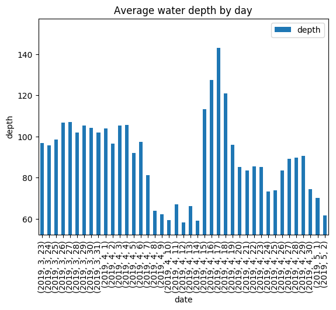

# Analysing data with Python

All of the sensor sampling and data upload is written in Python. But Python also has a very rich set of mathematical libraries and frameworks for analysing the data. This section describes the plot_data.py program that performs some mathematical analysis of the readings and generates some nice graphs.

## What does it do?
The program takes a CSV file containing data readings (download this from your ThingSpeak channel) then reads the data into a data structure. The code then uses the various python libraries to calculates means, standard deviations and group the data in different ways to get some kind of insights. All of the data is then turned into some nice-looking graphs.

Here are the graphs it produces. These are automatically refreshed on a regular basis and uploaded to github. So it is a kind of dashboard (not real-time, but at least every day):

### Raw data with some basic mean/std deviation
This is the raw data, but complemented with some other basic lines:
* mean water level
* smooth water readings calcualted using a rolling mean function
* standard deviation (+/- 1 std dev)

### Data cleaned by dropping readings > 1 std dev

### Average tank level during the day
OK, this doesn't make sense over a long period, but it is useful to see how the level fluctuates over the sample period.

### Average tank level per day
This is a bit more useful - it averages the readings for a given day and plots this on a timeline, showing how the water level fluctuates over the life-time of the project (up to the maximum 8000 data points allowed by ThingSpeak!)

## How does it do it?
I will write this up in more detail. In short:
* reading from the file is vanilla python
* vector handling and mathematical calculations (mean, standard deviation) are via numpy
* rolling mean calculations, 'group-by' operations and filtering of noisy data are via pandas (Series and Dataframes)
* graphs are generated using matplotlib (via pylot for non-pandas data, or the pandas API for more complex stuff)
